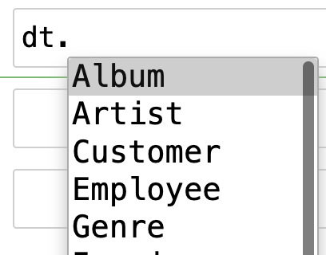
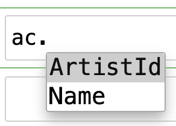
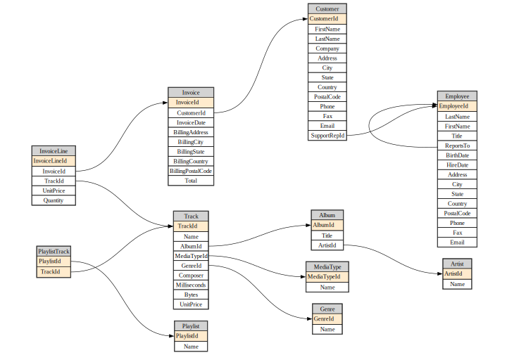
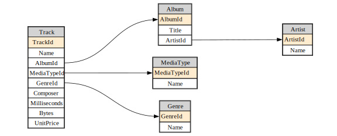

# fastlite


<!-- WARNING: THIS FILE WAS AUTOGENERATED! DO NOT EDIT! -->

`fastlite` provides some little quality-of-life improvements for
interactive use of the wonderful
[sqlite-utils](https://sqlite-utils.datasette.io/) library. It’s likely
to be particularly of interest to folks using Jupyter.

## Install

    pip install fastlite

## Overview

``` python
from sqlite_utils import Database
from fastlite import *
from fastcore.utils import *
from fastcore.net import urlsave
```

We demonstrate `fastlite`‘s features here using the ’chinook’ sample
database.

``` python
url = 'https://github.com/lerocha/chinook-database/raw/master/ChinookDatabase/DataSources/Chinook_Sqlite.sqlite'
path = Path('chinook.sqlite')
if not path.exists(): urlsave(url, path)

db = Database("chinook.sqlite")
```

Databases have a `t` property that lists all tables:

``` python
dt = db.t
dt
```

    Album, Artist, Customer, Employee, Genre, Invoice, InvoiceLine, MediaType, Playlist, PlaylistTrack, Track

You can use this to grab a single table…:

``` python
artist = dt.Artist
artist
```

    <Table Artist (ArtistId, Name)>

…or multiple tables at once:

``` python
dt['Artist','Album','Track','Genre','MediaType']
```

    [<Table Artist (ArtistId, Name)>,
     <Table Album (AlbumId, Title, ArtistId)>,
     <Table Track (TrackId, Name, AlbumId, MediaTypeId, GenreId, Composer, Milliseconds, Bytes, UnitPrice)>,
     <Table Genre (GenreId, Name)>,
     <Table MediaType (MediaTypeId, Name)>]

It also provides auto-complete in Jupyter, IPython, and nearly any other
interactive Python environment:



You can check if a table is in the database already:

``` python
'Artist' in dt
```

    True

Column work in a similar way to tables, using the `c` property:

``` python
ac = artist.c
ac
```

    ArtistId, Name

Auto-complete works for columns too:



Columns, tables, and view stringify in a format suitable for including
in SQL statements. That means you can use auto-complete in f-strings.

``` python
qry = f"select * from {artist} where {ac.Name} like 'AC/%'"
print(qry)
```

    select * from "Artist" where "Artist"."Name" like 'AC/%'

You can view the results of a select query using `q`:

``` python
db.q(qry)
```

    [{'ArtistId': 1, 'Name': 'AC/DC'}]

Views can be accessed through the `v` property:

``` python
album = dt.Album

acca_sql = f"""select {album}.*
from {album} join {artist} using (ArtistId)
where {ac.Name} like 'AC/%'"""

db.create_view("AccaDaccaAlbums", acca_sql, replace=True)
acca_dacca = db.q(f"select * from {db.v.AccaDaccaAlbums}")
acca_dacca
```

    [{'AlbumId': 1,
      'Title': 'For Those About To Rock We Salute You',
      'ArtistId': 1},
     {'AlbumId': 4, 'Title': 'Let There Be Rock', 'ArtistId': 1}]

## Dataclass support

A `dataclass` type with the names, types, and defaults of the tables is
created using `dataclass()`:

``` python
album_dc = album.dataclass()
```

Let’s try it:

``` python
album_obj = album_dc(**acca_dacca[0])
album_obj
```

    Album(AlbumId=1, Title='For Those About To Rock We Salute You', ArtistId=1)

You can get the definition of the dataclass using fastcore’s
`dataclass_src` – everything is treated as nullable, in order to handle
auto-generated database values:

``` python
src = dataclass_src(album_dc)
hl_md(src, 'python')
```

``` python
@dataclass
class Album:
    AlbumId: int | None = None
    Title: str | None = None
    ArtistId: int | None = None
```

Because `dataclass()` is dynamic, you won’t get auto-complete in editors
like vscode – it’ll only work in dynamic environments like Jupyter and
IPython. For editor support, you can export the full set of dataclasses
to a module, which you can then import from:

``` python
create_mod(db, 'db_dc')
```

``` python
from db_dc import Track
Track(**dt.Track.get(1))
```

    Track(TrackId=1, Name='For Those About To Rock (We Salute You)', AlbumId=1, MediaTypeId=1, GenreId=1, Composer='Angus Young, Malcolm Young, Brian Johnson', Milliseconds=343719, Bytes=11170334, UnitPrice=0.99)

There’s a shortcut to select from a table – just call it as a function.
If you’ve previously called `dataclass()`, returned iterms will be
constructed using that class by default. There’s lots of params you can
check out, such as `limit`:

``` python
album(limit=2)
```

    [Album(AlbumId=1, Title='For Those About To Rock We Salute You', ArtistId=1),
     Album(AlbumId=2, Title='Balls to the Wall', ArtistId=2)]

Pass a truthy value as the first param and you’ll get tuples of primary
keys and records:

``` python
album(1, limit=2)
```

    [(1,
      Album(AlbumId=1, Title='For Those About To Rock We Salute You', ArtistId=1)),
     (2, Album(AlbumId=2, Title='Balls to the Wall', ArtistId=2))]

`get` also uses the dataclass by default:

``` python
album.get(1)
```

    Album(AlbumId=1, Title='For Those About To Rock We Salute You', ArtistId=1)

If you want the dataclass-conversion behaviour for *all* tables (and
optionally views) then you can create them all at once with
[`all_dcs`](https://AnswerDotAI.github.io/fastlite/core.html#all_dcs).

``` python
dcs = all_dcs(db)
dcs[0]
```

    types.Album

## Insert, upsert, and update

The following methods accept `**kwargs`, passing them along to the first
`dict` param:

- `create`
- `transform`
- `transform_sql`
- `update`
- `insert`
- `upsert`
- `lookup`

``` python
cats = dt.cats
cats.create(id=int, name=str, weight=float, pk='id')
hl_md(cats.schema, 'sql')
```

``` sql
CREATE TABLE [cats] (
   [id] INTEGER PRIMARY KEY,
   [name] TEXT,
   [weight] FLOAT
)
```

…the same applies to `insert` here:

``` python
cat = cats.insert(name='meow', weight=6)
```

The inserted row is returned.

``` python
cat
```

    {'id': 1, 'name': 'meow', 'weight': 6.0}

Using `**` in upsert here doesn’t actually achieve anything, since we
can just pass a `dict` directly – it’s just to show that it works:

``` python
cat['name'] = "moo"
cats.upsert(**cat)
cats()
```

    [{'id': 1, 'name': 'moo', 'weight': 6.0}]

This all also works with dataclasses:

``` python
catdc = cats.dataclass()
cat = cats.get(1)
cat.name = 'foo'
cats.upsert(cat)
cats()
```

    [Cats(id=1, name='foo', weight=6.0)]

``` python
cats.drop()
cats
```

    <Table cats (does not exist yet)>

## Diagrams

If you have graphviz installed, you can create database diagrams:

``` python
diagram(db.tables)
```



Pass a subset of tables to just diagram those. You can also adjust the
size and aspect ratio.

``` python
diagram(db.t['Artist','Album','Track','Genre','MediaType'], size=8, ratio=0.4)
```


